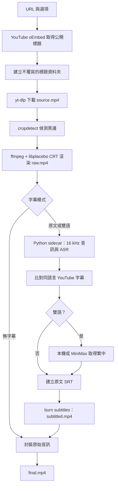

# Video2CRT 開發與維護手冊

> 文件版本：2026-09-18
> 適用範圍：`video2crt-app` Windows 桌面應用程式
> 目的：讓使用者、維護者與接手開發者能理解影片資料如何流動、如何測試與如何避免破壞已確認正確的 CRT 成果。

## 1. 專案目標與使用成果

Video2CRT 將一支公開 YouTube 影片轉成帶有 CRT 顯像效果的 MP4。應用程式以精靈流程提供網址、選項、進度與完成頁面，輸出可直接播放的 `final.mp4`，以及可檢查的字幕檔與中間檔。

使用者可選擇三種字幕成果：

| 選項 | 螢幕字幕 | 翻譯需求 |
| --- | --- | --- |
| 只有原文字幕 | 原始語言的一行字幕 | 不翻譯 |
| 原文＋繁體中文字幕 | 非中文：原文＋繁中兩行；中文：繁中一行 | 需要翻譯 |
| 無字幕 | 不產生或燒錄字幕 | 不需要 |

核心原則如下：

- CRT shader、裁切策略、輸出尺寸與影音封裝是獨立的視訊處理流程；修字幕時不得順帶改動它們。
- 原文字幕優先使用與語言相符、時間完整的 YouTube 字幕；不符合時再用本機 faster-whisper 辨識。
- 繁中翻譯預設在本機進行。MiniMax API Key 是選填，只供雲端字幕翻譯使用，影片下載、CRT 渲染與本機字幕不依賴它。
- 輸出資料夾使用影片標題，不使用 YouTube ID；同名不覆寫，而是加上 `(2)`、`(3)` 等序號。
- 預設輸出位置為使用者桌面；使用者也可選取上層輸出資料夾。

## 2. 技術架構與原始碼位置

| 層級 | 技術 | 主要檔案 | 職責 |
| --- | --- | --- | --- |
| 桌面 UI | React、TypeScript、Vite | `src/App.tsx`、`src/pages/` | 取得網址、選項、進度、完成結果 |
| 桌面容器 | Tauri 2 | `src-tauri/src/lib.rs` | 註冊 UI 指令與事件 |
| 流程協調 | Rust、Tokio | `src-tauri/src/orchestrator.rs` | 下載、裁切、CRT、字幕 sidecar、錯誤與進度 |
| 字幕處理 | Python | `src-tauri/bin/pipeline_cli.py` | ASR、字幕來源選擇、SRT、字幕燒錄與封裝 |
| 字幕規則 | Python | `src-tauri/bin/subtitle_engine.py` | 時間軸正規化、YouTube VTT/SRT、繁簡轉換、本機翻譯 |
| 雲端翻譯 | Rust | `src-tauri/src/translator.rs` | MiniMax 模型清單與文字翻譯 |
| 高品質模型安裝 | Rust + React | `src-tauri/src/model_manager.rs`、`src/components/ModelInstallDialog.tsx` | 使用者確認後下載、進度、取消與 manifest 完整性檢查 |
| 金鑰儲存 | Windows Credential Manager | `src-tauri/src/settings.rs` | 只保存、讀取與刪除 API Key；UI 不讀回 key 內容 |
| CRT shader | GLSL | `scripts/crt.glsl` | libplacebo 顯像效果 |
| 回歸測試 | Python / Rust | `scripts/test_subtitle_contract.py`、`src-tauri/src/orchestrator.rs` | 保護字幕與下載回退契約 |

## 3. 使用流程

1. 在首頁貼上單一 YouTube URL。
2. 在選項頁選擇裁切、ASR 語言、字幕模式、翻譯方式與輸出位置。
3. 按「開始轉檔」。UI 立刻鎖定開始按鈕，避免同一輸出資料夾同時執行兩條流程。
4. 進度頁依序顯示：下載、裁切偵測、CRT 渲染、ASR、字幕翻譯、字幕燒錄、封裝。
5. 完成頁提供輸出資料夾、`final.mp4`、`zh-Hant.srt` 與在 Explorer 開啟按鈕。

若字幕功能需要而高品質模型尚未安裝，開始轉檔前會先顯示模型確認視窗。選擇標準模型會直接繼續，選擇安裝則下載約 3.2 GB；無字幕模式不會觸發此提示。

### 選項說明

- **裁切參數**：格式為 `W:H:X:Y`。留空時使用 `ffmpeg cropdetect` 對該片源偵測黑邊；手動輸入時，手動值優先。
- **ASR 語言**：可選自動、日文、英文、中文。`auto` 會傳成空值讓 Whisper 自動判斷。
- **翻譯方式**：
  - `本機端翻譯`：完全不傳送字幕文字到翻譯雲端。
  - `本機端優先，失敗時使用雲端翻譯`：只有本機翻譯失敗且已儲存 API Key 時才呼叫 MiniMax。
  - `純雲端翻譯`：需要 API Key，缺少時選項頁會開啟設定畫面。
- **輸出資料夾**：欄位留空代表桌面。系統會在該位置建立影片標題資料夾，既有資料夾不會被覆寫。

## 4. 完整轉換流程



### 4.1 影片標題與輸出資料夾

流程在下載前向 YouTube oEmbed 取得公開標題，並將 Windows 不可用字元替換為全形底線。資料夾建立採保留策略：同名既有時改建 `標題 (2)`，不會覆蓋舊成果。若標題查詢失敗，流程停止，避免退回 `yt_<id>` 資料夾而違反輸出命名需求。

### 4.2 下載與 YouTube 驗證回退

第一順位下載使用 yt-dlp 的最佳影音格式選擇：`bv*+ba/b`、合併為 MP4、禁止 playlist、使用 Node 解 JavaScript challenge，並使用 EJS 元件取得較完整格式。

YouTube 可能對預設 web client 要求 PO Token／Visitor Data，或回應 HTTP 429。只有錯誤訊息符合這三種 access gate 時，程式才會自動再嘗試一次 `web_embedded` client。此回退只適合公開且允許嵌入的影片；它不是 Cookie、帳號或 API Key 的替代品。

這個設計保留原本成功時的高畫質下載命令。回退不存在於一般下載、字幕、CRT 與封裝路徑中。

### 4.3 黑邊裁切與 CRT 渲染

`cropdetect` 只提供影片專屬的裁切提示；它不是保證正確的視覺判斷。混合比例影片、彩色條紋或片源內建特效都可能造成誤判。對畫面正確但裁切錯誤的影片，應在選項頁輸入已確認的 `W:H:X:Y`，不要修改全域預設。

CRT 渲染會：

1. 將 shader 複製到本次輸出資料夾，避免 Windows 絕對路徑中的 `:` 被 libplacebo 當成濾鏡參數。
2. 先用 ffprobe 判斷來源編碼，選擇合適的 CUDA 解碼器或軟體解碼。
3. 以 `crop=<值>,libplacebo=custom_shader_path=crt.glsl:w=1920:h=1080:fps=30:force_original_aspect_ratio=0` 產生無聲的 `raw.mp4`。
4. 保留既有的 shader、1920×1080、裁切與渲染策略；字幕功能不得改變這一步。

### 4.4 ASR 與原文字幕選擇

Python sidecar 先將 `source.mp4` 萃取為 16 kHz 單聲道 WAV，然後使用安裝包內的標準 faster-whisper 模型。若使用者已確認並完成高品質模型安裝，Rust sidecar 環境會優先指向 `%LOCALAPPDATA%\Video2CRT\models\large` 的 pinned `faster-whisper-large-v3-turbo`；影片音訊不會上傳。

Whisper 的 word timestamps 若觸發已知 NumPy 對齊錯誤，ASR 會改以不帶 word timestamps 的模式重試，而不是中止整支影片。

接著系統以以下順序決定原文字幕：

1. 對比 YouTube 同原語言字幕與 ASR 偵測語言。
2. 只有語言相符、至少兩段、且時間範圍沒有明顯短缺的 YouTube 字幕，才取代 ASR。
3. YouTube 字幕不完整、語言不符或只是翻譯字幕時，保留本機 ASR。
4. 片源提供繁中字幕時，依時間重疊對齊到原文段落；不同切段會先合併為完整雙語 cue。

字幕時間會排序、去重、限制到影片時長並消除重疊。開始時間相同的 ASR 替代段落會保留較完整者；倒退或無效時間則明確報錯，避免產生錯位 SRT。

### 4.5 翻譯與繁體中文處理

- 中文原文以本機 OpenCC 轉為繁體，輸出一行，不會再加上重複翻譯行。
- 非中文原文在雙語模式輸出兩行：原文在第一行、繁中在第二行。
- 本機翻譯使用安裝包內已釘選的 M2M100 CTranslate2 標準模型；完成高品質模型安裝後才切換到 pinned 1.2B 模型。下載的是模型資料，不含使用者影片或字幕上傳。
- 若採用 `cloudFallback`，本機翻譯失敗時才逐段呼叫 MiniMax；`cloud` 模式直接呼叫 MiniMax。
- MiniMax 回覆會移除 `<think>...</think>`、多餘標籤與格式字元，防止模型內部推理文字進入影片。
- 未完成必要翻譯時，流程在燒錄前失敗；不應輸出混雜錯誤說明或不完整雙語的 `final.mp4`。

### 4.6 字幕燒錄與封裝

字幕燒錄在輸出資料夾內以相對檔名呼叫 ffmpeg，避開 Windows 路徑中的冒號破壞 libass filter。已確認的字幕燒錄視訊設定為：

```text
-c:v h264_nvenc -preset p4 -cq 23 -pix_fmt yuv420p -an
```

這是使用者認可的既有視覺基準。字幕燒錄完成產生 `subtitled.mp4`；若沒有任何有效 cue，會改用 `raw.mp4`。最後將選定畫面與 `source.mp4` 的原始音訊封裝成 `final.mp4`。

## 5. 輸出資料與格式

每個工作都在 `桌面\<YouTube 影片標題>\` 或使用者指定的父資料夾下建立同名子資料夾。常見檔案如下：

| 檔案 | 格式 | 用途 | 是否應交付 |
| --- | --- | --- | --- |
| `source.mp4` | MP4 | yt-dlp 下載的來源影音 | 保留作追查用 |
| `raw.mp4` | MP4，無聲 | CRT 渲染結果，尚未燒字幕 | 保留作畫質比對 |
| `source_16k.wav` | WAV | ASR 暫存音訊 | 可保留供除錯 |
| `faster_whisper_out.json` | JSON | 原始 ASR 段落 | 保留供字幕除錯 |
| `subtitle_segments.json` | JSON | 正規化後原文 cue | 保留 |
| `subtitle_translations.json` | JSON | 原文到繁中的對照 | 保留；不含 API Key |
| `subtitle_source.json` | JSON | 原文來源、語言、段數 | 保留 |
| `zh-Hant.srt` | UTF-8 SRT | 最終燒錄用字幕 | 可交付 |
| `subtitled.mp4` | MP4，無聲 | 已燒字幕的中間畫面 | 保留供比對 |
| `final.mp4` | MP4 | CRT 成品，含原始音訊 | 主要交付檔 |
| `crt.glsl` | GLSL | 本次使用的 shader 副本 | 保留供可重現性 |

所有字幕文字檔均以 UTF-8 寫入。SRT 使用 `HH:MM:SS,mmm --> HH:MM:SS,mmm` 時間格式。

## 6. API Key 與隱私

MiniMax API Key 以 Windows Credential Manager 儲存，識別為 service `Video2CRT`、user `default`。UI 只能知道是否已設定，不會讀回或顯示已存 key；輸入欄位使用密碼遮罩。刪除按鈕會移除 Credential Manager 內的憑證。

禁止事項：

- 不要將 key 寫進 `.env`、設定檔、手冊、Git commit、日誌或輸出 JSON。
- 不要以截圖、錯誤訊息或測試 fixture 包含真實 key。
- 不要把使用者的 Cookie、登入狀態或帳號資料加入下載器。

資料離開電腦的情況只有三種：YouTube 下載／字幕請求、首次下載本機模型資料、以及使用者主動選擇雲端翻譯時傳送的字幕文字。影片的 ASR 本身在本機執行。

## 7. 建置與執行

### 開發環境需求

- Windows 10/11、WebView2。
- Node.js 與 npm。
- Rust stable（本專案 `rust-version = 1.77`）。
- Python，以及 `faster-whisper`、CTranslate2、SentencePiece、Hugging Face Hub 等 sidecar 依賴。
- ffmpeg，需具備 libplacebo、字幕濾鏡與可用的 NVIDIA NVENC／CUDA 路徑。
- yt-dlp 與 Node runtime。

### 常用命令

```powershell
# 前端型別檢查與正式靜態建置
npm run build

# Tauri 開發模式
npm run tauri:dev

# Rust 測試
Set-Location src-tauri
cargo test

# 建置 release 可執行檔
cargo build --release

# Python 字幕契約回歸測試
Set-Location ..
python -m unittest scripts/test_subtitle_contract.py -q
```

目前正式發布包位於 `dist-distributable\Video2CRT_0.1.0_x64-setup.exe`；Tauri 設定的 bundle target 為每使用者安裝的 NSIS，並已完成本機 silent install 冒煙驗證。乾淨 Windows 使用者帳戶與完整影片 GUI E2E 仍未在本輪驗證，不可把這兩項寫成已完成。

## 8. 測試與驗收流程

### 8.1 快速回歸

每次改動字幕、翻譯或下載邏輯後，至少執行：

1. `python -m unittest scripts/test_subtitle_contract.py -q`
2. `cargo test`
3. `npm run build`
4. `git diff --check`

字幕契約測試涵蓋：ASR word timestamp 重試、相同開始時間去重、時間軸合法性、原文／雙語／無字幕模式、中文單行、YouTube 字幕語言與時間對齊、未翻譯時禁止燒錄，以及 NVENC CQ 23 字幕燒錄設定。

### 8.2 單支影片端到端驗收

使用一支公開、短片且有明確語音的影片，於新的測試輸出資料夾執行一次完整流程。不可覆寫使用者既有資料夾。完成後檢查：

```powershell
ffprobe -v error -show_streams -show_format final.mp4
ffprobe -v error -show_streams source.mp4
```

驗收條件：

- `final.mp4` 有視訊與音訊 stream，時長合理。
- `raw.mp4` 與 `final.mp4` 的畫面比例、裁切與 CRT 效果一致；字幕不可改變畫面銳利度或尺寸。
- `zh-Hant.srt` 時間連續、不倒退、不重疊，非中文雙語、中文單行。
- 抽取至少開頭、中段、結尾的畫面，人工比對字幕是否對應語音、是否過大或遮住重要畫面。
- 先檢查 `source.mp4` 再判斷畫質；低解析來源放大後仍會保留來源本身的模糊與 CRT 掃描線，不能把它誤判成字幕轉碼造成的退化。

### 8.3 本輪實際驗證紀錄

2026-09-18 已完成：

| 檢查 | 結果 | 範圍 |
| --- | --- | --- |
| `npm run build` | 通過 | TypeScript 與 Vite production build |
| `python scripts/install_skill.py` | 38 條 gotcha，`[ALL PASS]` | 36 是最低新鮮度門檻，不是總數 |
| `python tests/run_all.py` | 13 項通過 | 根目錄環境與 Whisper stage 回歸 |
| `python -m unittest scripts/test_subtitle_contract.py -q` | 26 項通過 | 不含模型與網路的字幕契約 |
| `cargo test --all-targets -- --test-threads=1` | 12 項通過 | 11 library unit + 1 integration |
| 自動化測試合計 | 51 項通過 | 13 + 26 + 12；不含僅編譯的 binary harness |
| Rust 下載回退單元測試 | 通過 | PO Token／429 才啟用 embedded fallback |
| ANA 測試影片 embedded 下載 | 通過 | 實際下載 29.97 秒、1440×1080 AV1、含 Opus 音訊 |
| `cargo test ... model_manager::tests` | 通過 | 模型 manifest 不完整時不標記為可用；這是窄範圍測試，不是 Rust 全部測試數 |
| `powershell -File scripts/build-distributable.ps1` | 通過 | NSIS 安裝包產生至 `dist-distributable` |
| silent install + 啟動 5 秒 | 通過 | installer exit 0，安裝後 `video2crt.exe` 持續執行 |

尚未在本輪重新完成 GUI 啟動到 `final.mp4` 的整條端到端視覺驗收。因此，下載回退已驗證，完整成品流程仍應在新的隔離資料夾完成一次 E2E 後，才可標記為全流程通過。

## 9. 常見問題與處置

| 現象 | 判斷與處置 |
| --- | --- |
| 0% 就顯示無法取得標題 | 檢查 YouTube URL 與公開可用性。標題用 oEmbed 取得，不能使用 ID 資料夾作替代。 |
| `Missing required Visitor Data`、PO Token 或 429 | 程式會自動嘗試一次 embedded client。若仍失敗，表示影片不允許嵌入或 YouTube 仍限制連線；不要把 Cookie 寫入專案。 |
| ASR 出現 boolean index 或 word timestamp 例外 | 應由 ASR 自動改用無 word timestamps 重試；若仍失敗，保留錯誤與來源檔再追查。 |
| `字幕開始時間重複` 或無效時間 | 應由 `normalize_segments` 合併同起始替代段落並裁切重疊；若時間本身倒退，重新辨識該片段。 |
| 字幕出現 `<think>` 或說明文字 | 檢查 `clean_subtitle_translation`；這類文字不得寫入 SRT。 |
| 雙語字幕沒有繁中 | 檢查翻譯模式、模型是否已下載、本機翻譯錯誤及 MiniMax key 狀態。未完成翻譯不應燒錄成品。 |
| 中文多出兩行 | 中文原文應透過 OpenCC 直接輸出一行；檢查語言判斷與 `build_srt_two_line`。 |
| 畫質在有字幕時變差 | 比對 `raw.mp4`、`subtitled.mp4` 與 `final.mp4`。字幕燒錄必須保留 `h264_nvenc / p4 / cq 23`，不得為了字幕改用另一組壓縮品質。 |
| 黑邊裁錯或畫面被切掉 | 不要改全域裁切值；改用此影片的手動 `W:H:X:Y`，並用多個時間點檢查混合比例畫面。 |

## 10. 維護規則與禁止變更

1. 修改字幕邏輯前，先從 `raw.mp4` 與 `final.mp4` 的差異確認問題是否真的在字幕階段。
2. 不要為修單一影片而改寫所有影片的裁切、shader、輸出尺寸或編碼參數。
3. 不要自動刪除、覆寫或移動既有輸出資料夾；新成果必須使用新資料夾。
4. 不要把 API Key、Cookie、模型快取或使用者影片加入 Git。
5. 下載失敗時，先保留完整 yt-dlp 最後錯誤行與所用 client；不要以「YouTube 突然驗證」作沒有證據的結論。
6. 任何下載器回退應只針對明確錯誤條件、只執行有限次數，並保留原本成功時的高畫質路徑。
7. 每次改動都先看 Git 工作樹。此專案的父層存在歷史輸出與未提交成果，提交時必須只 stage 指定檔案。


### CRT skill gotcha 版本基準

接手者在處理影片、字幕、裁切或 CRT 前，必須在專案根目錄執行 `python scripts/install_skill.py`。目前本機實測為 **38 條 gotcha**，編號為 **0–31、33–38**；32 號沒有條目。自檢程式中的 `EXPECTED_GOTCHA_COUNT = 36` 只表示最低新鮮度門檻，並非總數。請記錄每次輸出的 `Found N gotchas in SKILL.md`；若少於 36、skill 找不到或依賴檢查失敗，先停止並釐清環境，不要開始轉檔。舊 handoff、CHANGELOG 或截圖中出現的 21、23、30 都是歷史數字，不能當作目前規格。

## 11. 建議的修改順序

對新 bug 採以下順序，避免再次連鎖破壞：

1. **重現與分類**：先判斷在下載、裁切、CRT、ASR、翻譯、燒錄還是封裝。
2. **建立窄測試**：例如字幕問題寫到 `test_subtitle_contract.py`；下載命令問題寫 Rust 純函式或隔離探測。
3. **只改一層**：字幕問題只改 Python 字幕層；不要同步改輸出命名或下載參數。
4. **驗證中間檔**：`source.mp4 → raw.mp4 → subtitled.mp4 → final.mp4` 逐段比對。
5. **隔離 E2E**：使用新的測試輸出資料夾，保留使用者桌面成果。
6. **提交前檢查**：檢查 staged diff、敏感字串、測試結果與未驗證事項。

## 12. 現況與下一步

目前主功能、字幕模式、翻譯模式、Credential Manager 儲存、標題輸出資料夾、下載回退、self-contained NSIS 發布包與高品質模型確認式安裝皆已實作。已知仍需完成的工作是：用乾淨 Windows 使用者帳戶驗證安裝流程、實際下載高品質模型，以及在最新程式碼上完成一次 GUI 到 `final.mp4` 的完整視覺 E2E。

接手者應先閱讀本手冊，再檢查 `git status`、`src-tauri/src/orchestrator.rs`、`src-tauri/bin/pipeline_cli.py` 與 `scripts/test_subtitle_contract.py`。不要以舊輸出資料夾或舊 handoff 的結果取代當前程式碼的驗證。
